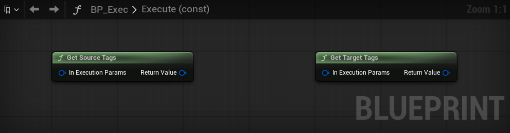
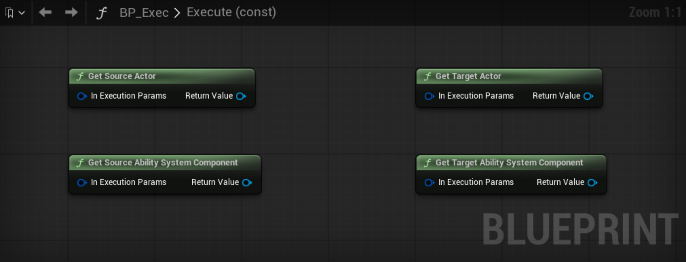
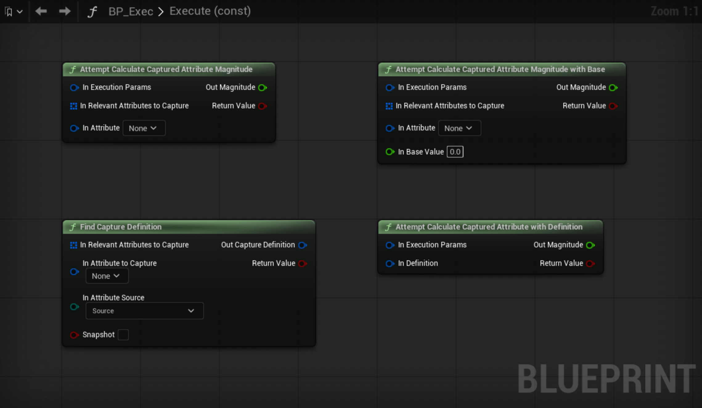
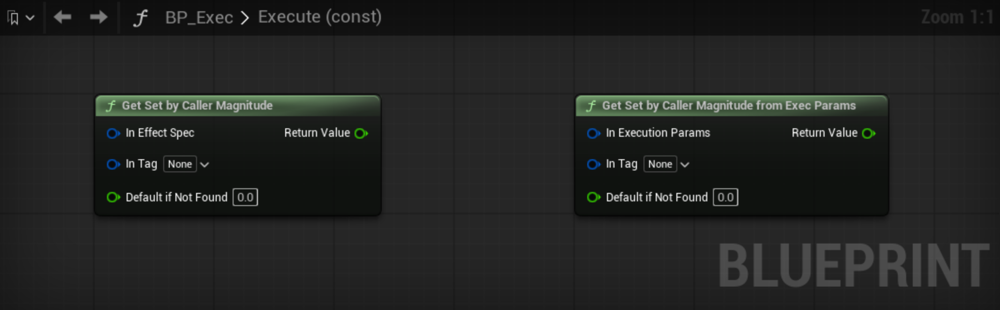
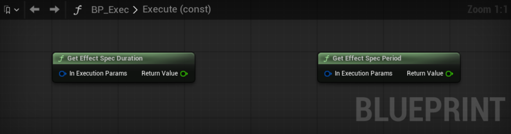
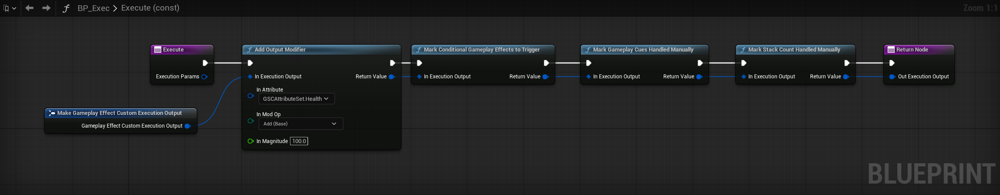
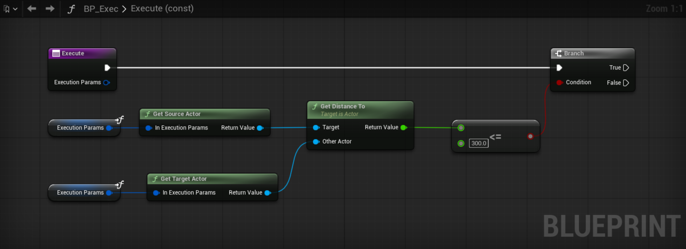
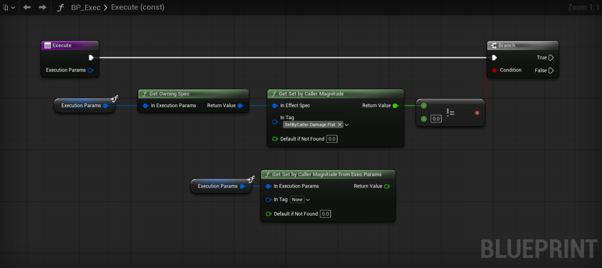
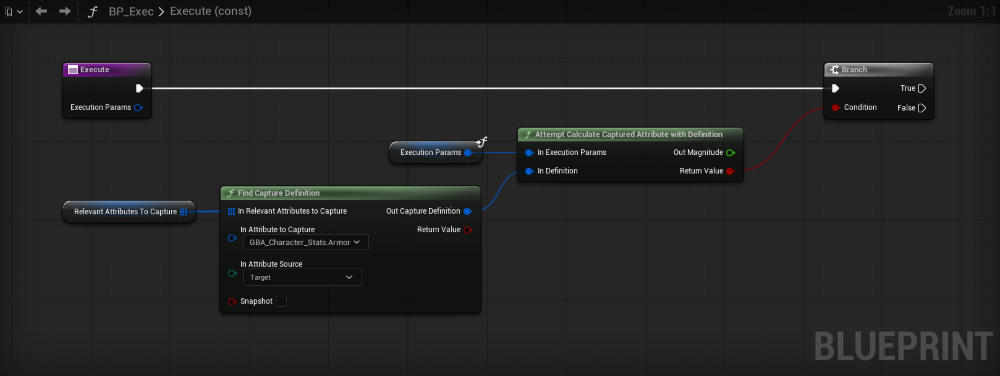

import Zoom from 'react-medium-image-zoom'
import { Callout } from 'nextra/components'

## Gameplay Effect Execution Calculation

<Callout type="info">
**Related** https://github.com/tranek/GASDocumentation#concepts-ge-ec
</Callout>

### Requirements

Blueprint parent class needs to be `UGameplayEffectExecutionCalculation`.

Override the functions `Execute`, the equivalent of the `Execute_Implementation.` when done in C++.

<Zoom>

</Zoom>

Make sure to edit the `Relevant Attributes to Capture` in Class Defaults, with all the Attributes your calculation will need. You can tweak this array as you go depending on the implementation of your execution.

<Zoom>

</Zoom>

### Calculation

Blueprint Attributes defines a set of Blueprint statics (methods from within a Blueprint Library globally accessible) to help in the implementation. They all take as an input parameter the original `FGameplayEffectCustomExecutionParameters` structure that is passed down to the `Execute` method as an input parameter. Since it's a method (and not an event in the main event graph), feel free to leverage the fact it is a local variable to help in reducing wires throughout the event graph for your method.

Simply type `Get Execution Params` anywhere in the method event graph to access it.

<Zoom>

</Zoom>

By default, `UGameplayEffectExecutionCalculation` is Blueprintable but doesn't define any Blueprint exposed methods or helpers to actually base the entire calculation logic purely in Blueprint. Those custom methods were designed to help implementing Exec Calc classes in Blueprints.

They can work off Attributes defined in either C++ or within Blueprint AttributeSets (GBA prefixed in this sample).

#### Spec & Context

- `GetOwningSpec()` — Returns the owning `FGameplayEffectSpec` for the execution parameters.
- `GetEffectContext()` — Returns the `FGameplayEffectContextHandle` from the owning spec.

<Zoom>

</Zoom>

#### Tags

- `GetSourceTags()` — Returns the aggregated source tags captured on the owning spec (empty static container if none captured).
- `GetTargetTags()` — Returns the aggregated target tags captured on the owning spec (empty static container if none captured).

<Zoom>

</Zoom>

#### Actor & ASC Access

- `GetSourceActor()` — Returns the source avatar actor from the execution parameters. Returns `nullptr` if no source ASC is available.
- `GetTargetActor()` — Returns the target avatar actor from the execution parameters. Returns `nullptr` if the target ASC has no avatar.
- `GetSourceAbilitySystemComponent()` — Returns the source `UAbilitySystemComponent` from the execution parameters. Returns `nullptr` if there is no source.
- `GetTargetAbilitySystemComponent()` — Returns the target `UAbilitySystemComponent` from the execution parameters.

These are useful for casting to your character class, querying state, or making context-aware decisions during execution.

<Zoom>

</Zoom>

#### Captured Attribute Magnitude

- `AttemptCalculateCapturedAttributeMagnitude()` — Attempts to calculate the magnitude of a captured attribute by finding its definition in the relevant attributes array (matches Source capture, non-snapshot).
- For this to work correctly, the Attribute needs to be added to the Relevant Attributes to Capture array.
- `AttemptCalculateCapturedAttributeMagnitudeWithBase()` — Same as above but with a base value to evaluate the attribute under.
- For this to work correctly, the Attribute needs to be added to the Relevant Attributes to Capture array.
- `FindCaptureDefinition()` — Finds a capture definition from the relevant attributes array by matching attribute, capture source (Source/Target), and snapshot flag. Returns the matching `FGameplayEffectAttributeCaptureDefinition` if found. Use this when you need more control over which capture definition to use.
- `AttemptCalculateCapturedAttributeWithDefinition()` — Calculates the magnitude of a captured attribute using a capture definition you provide directly (e.g. from `FindCaptureDefinition`). Skips the automatic lookup, useful when you need to evaluate a Target-captured or snapshotted attribute.

<Zoom>

</Zoom>

#### Set By Caller

- `GetSetByCallerMagnitude()` — Extracts the Set By Caller magnitude from a `FGameplayEffectSpec` using a gameplay tag. Takes a default value to return if the magnitude hasn't been set.
- `GetSetByCallerMagnitudeFromExecParams()` — Same as above but works directly from the execution parameters (extracts the spec internally).

These are useful for parameterized damage, healing, or any magnitude driven by the GE's Set By Caller data.

<Zoom>

</Zoom>

#### Effect Spec Properties

- `GetEffectSpecDuration()` — Returns the duration of the owning Gameplay Effect Spec in seconds. Returns `-1.0` for infinite duration effects.
- `GetEffectSpecPeriod()` — Returns the period of the owning Gameplay Effect Spec in seconds. Returns `0.0` for non-periodic effects.

<Zoom>

</Zoom>

#### Output Modifiers

- `AddOutputModifier()` — Adds an output modifier to the execution output with the given attribute, mod op, and magnitude. Returns a reference to the execution output for chaining multiple modifiers.

#### Execution Output Marking

- `MarkStackCountHandledManually()` — Marks that the execution has manually handled the stack count and the GE system should not attempt to automatically act upon it for emitted modifiers.
- `MarkConditionalGameplayEffectsToTrigger()` — Marks that the execution wants conditional gameplay effects to trigger when it completes.
- `MarkGameplayCuesHandledManually()` — Marks gameplay cues as handled manually, preventing the engine from automatically triggering cues for this execution.

All three return a reference to the execution output for chaining.

<Zoom>

</Zoom>

## Example

1. Capture Source / Target tags and relevant Attributes (don't forget to add them to the Relevant Attributes to Capture prop in class defaults)

<Zoom>

</Zoom>

`SourceTags`, `TargetTags`, `BaseDamage`, `AttackPower`, `Armor` are all local variables.

2. Do the calculation (based on info gathered in step 1.)

<Zoom>

</Zoom>

3. Add any number of output modifiers and return the Execution Output.

<Zoom>

</Zoom>

These output modifiers don't necessarily need to be captured as Relevant Attributes.

Make sure to return the result Execution Output.

If you want to output more than one modifier, you can do so by chaining the calls and passing down the Execution Output of one modifier to the next.

The first one will have to `Make GameplayEffectCustomExecutionOutput` the initial structure.

<Zoom>

</Zoom>

## Advanced Examples

### Getting Source and Target Actors

You can retrieve the source and target actors from the execution parameters to make context-aware decisions:

- GetSourceActor() → Cast to CharacterClass/Interface → Query custom properties
- GetTargetActor() → Cast to CharacterClass/Interface → Check state / apply logic

This is useful for things like checking if the target is in a specific state, applying location-based modifiers, or accessing custom interfaces.

### Using Set By Caller Magnitudes

When your Gameplay Effect uses Set By Caller tags, you can extract those magnitudes directly in your execution calculation:

### Marking Execution Output Flags

For advanced GE behavior, you can mark special flags on the execution output:

<Zoom>

</Zoom>

These are chainable — each returns the execution output reference so you can wire them together before returning.

### Using FindCaptureDefinition for Target Attributes

The convenience methods `AttemptCalculateCapturedAttributeMagnitude` and `AttemptCalculateCapturedAttributeMagnitudeWithBase` always look for a **Source** capture with **bSnapshot = false**. For Target-captured or snapshotted attributes, use the two-step approach:

This gives you full control over which capture definition is used for the magnitude calculation.
